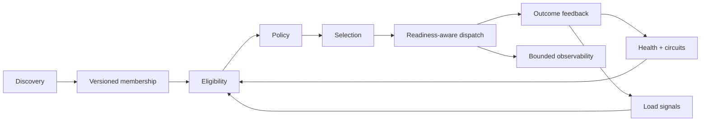

# Poise

[](https://github.com/copyleftdev/poise-rs/actions/workflows/ci.yml)
[](https://github.com/copyleftdev/poise-rs/actions/workflows/security.yml)
[](https://doc.rust-lang.org/stable/releases.html#version-1850-2025-02-20)
[](Cargo.toml)
[](docs/testing.md)
[](#license)

Composable, runtime-independent load-balancing primitives for Rust.

Poise separates membership, eligibility, selection, dispatch, and feedback so
that sophisticated routing remains explainable. Simple policies are small and
direct. Affinity, topology, health, discovery, and readiness integrations build
on the same contracts instead of hiding a second balancing system behind an
adapter.

> [!IMPORTANT]
> Poise is pre-1.0. Its behavioral contracts are heavily tested, but the six
> crates remain unpublished until the protected first-release workflow claims
> their crates.io names. Use Git dependencies only if pre-release API change is
> acceptable for your application.

## Why Poise exists

Load balancing is larger than choosing an index. A production request passes
through several independently fallible decisions:



Poise gives each boundary a concrete contract. Policies select; they do not
dispatch. Discovery publishes immutable generations; it does not mutate a live
candidate slice in place. Health and load are candidate signals; they do not
silently replace selection semantics. Tower retains readiness after selection,
and telemetry avoids endpoint-derived cardinality by default.

## Workspace

| Crate | Responsibility | Runtime dependency |
| --- | --- | --- |
| `poise-core` | Candidate contracts, selection policies, affinity, topology, and load trackers | None |
| `poise-discovery` | Atomic versioned snapshots, subscriptions, reconciliation inputs, and graceful draining | None |
| `poise-health` | Active probes, passive circuits, rolling outcomes, and group-relative outlier detection | None |
| `poise-tower` | Readiness-correct dispatch and optional snapshot-to-service reconciliation | Tower |
| `poise-tokio` | Optional probe timing and asynchronous discovery waits | Tokio |
| `poise-observe` | Fixed-cardinality counters and optional structured tracing | Optional Tower / tracing |

There is intentionally no umbrella crate. Applications depend only on the
layers they use, and the deterministic policy core does not inherit an async
runtime.

## Policy surface

| Family | Included primitives | Primary contract |
| --- | --- | --- |
| Stateless selection | Random, weighted random, power of two choices, least loaded | Select only eligible, in-bounds candidates |
| Stateful rotation | Round robin, smooth weighted round robin | Stable cycles and explicit identity-keyed state |
| Affinity | Rendezvous, weighted rendezvous, ring hash, Maglev | Deterministic placement and bounded disruption under churn |
| Load-aware affinity | Bounded-load weighted rendezvous | Preserve affinity while enforcing prospective capacity |
| Priority | Weighted priority tiers, overprovisioned failover, panic thresholds | Select a health scope before endpoint weighting |
| Locality | Health-adjusted locality weighting and spillover | Preserve priority and topology metadata |
| Feedback | In-flight accounting and peak EWMA | RAII-safe load updates under completion and cancellation |

See the focused contracts for [weighted rendezvous](docs/weighted-rendezvous.md),
[ring hash](docs/ring-hash.md), [Maglev](docs/maglev.md),
[bounded-load affinity](docs/bounded-load-affinity.md),
[priority routing](docs/priority-routing.md), and
[locality routing](docs/locality-routing.md).

## Minimal policy example

```rust
use poise_core::{Backend, Policy, policy::RoundRobin};

let backends = [Backend::new("a"), Backend::new("b")];
let mut policy = RoundRobin::new();

let selected = policy.pick(&backends, &())?;
assert_eq!(backends[selected.index()].id(), &"a");
# Ok::<(), poise_core::PickError>(())
```

Selection returns an index plus policy-specific decision metadata. The caller
retains ownership of the candidate collection and decides how dispatch,
readiness, retries, and feedback are performed.

## Composition model

### Membership

`poise-discovery` publishes immutable, monotonically versioned snapshots.
Readers keep valid handles to older snapshots while a newer generation becomes
visible atomically. Removal can enter a draining state before physical
retirement, and failed batches do not partially commit.

### Eligibility

Candidates expose identity, status, and weight without forcing one concrete
backend type. Health wrappers compose active classification, passive circuit
state, outcome windows, and underlying service availability. Draining and
operator opt-out are never revived by panic routing.

### Selection

`Policy` implementations are deterministic when seeded, make empty and
ineligible outcomes distinct, and do not own dispatch. Cached policies rebuild
transactionally when relevant membership changes.

### Dispatch

`poise-tower` polls readiness before policy selection and retains the selected
service's readiness permit until the call. Invalid custom-policy indices,
readiness failures, cancellation, and response errors remain explicit and
endpoint-aware.

### Feedback and observation

Load guards distinguish completion from cancellation. `poise-observe` records
decision and attempt outcomes with fixed dimensions, saturating counters, and
optional tracing spans without placing telemetry dependencies in the policy
data plane.

For the full boundary model, read [Architecture](docs/architecture.md), the
[Tower dispatch contract](docs/tower.md),
[discovery reconciliation](docs/discovery-tower.md),
[Tokio integration](docs/tokio.md), and
[observability](docs/observability.md).

## Verification standard

Poise treats behavioral laws as public API.

- **240 authored test entry points** cover examples, edge conditions,
  distributions, concurrency, cancellation, and transactional failure.
- **14 Proptest laws** run 256 generated cases each by default and shrink
  failures into committed regression seeds.
- **Mutation testing** requires every terminating viable `poise-core` mutation
  to be caught. The recorded full campaign examined 642 sites with zero viable
  survivors; watchdog-detected nontermination remains visible.
- **Six Loom models** exhaustively explore scheduler interleavings around
  in-flight accounting and health state transitions.
- **MSRV verification** runs the workspace and all features on Rust 1.85.
- **Doctests, strict Clippy, rustfmt, rustdoc, dependency policy, and package
  dry-runs** are release gates.

Run the fast local gate:

```console
cargo fmt --all -- --check
cargo clippy --workspace --all-targets --all-features -- -D warnings
cargo test --workspace --all-features
```

Run the scheduler models separately:

```console
scripts/model-check.sh
```

Mutation testing is intentionally explicit and resource-bounded. It is not part
of the default local hook:

```console
scripts/mutants-core.sh --jobs 1
```

Do not run the fuzz targets without reading the resource limits in
[Fuzzing and concurrency](docs/fuzzing.md). The complete strategy is documented
in [Testing and verification](docs/testing.md) and
[Mutation testing](docs/mutation-testing.md).

## Invariant Orrery

The [interactive capability showcase](https://copyleftdev.github.io/poise-rs/)
replays a structured
verification record as a bounded kinetic system. It does not execute tests,
fuzzers, or mutation workloads in a visitor's browser. The renderer caps
particles and device pixel ratio, pauses offscreen, and provides semantic and
reduced-motion fallbacks.

Its [data contract](docs/showcase.md) distinguishes live, recorded, stale,
failed, and unavailable evidence. GitHub Pages publishes failing runs as broken
proofs while leaving the associated Actions workflow red.

## Performance stance

The core is designed to be allocation-conscious and deterministic, but Poise
does not publish unsupported performance claims. Criterion baselines across
small and large backend sets are still a release-roadmap item. Until those
baselines land, evaluate the exact candidate counts, churn rates, and policy
families used by your deployment.

## Compatibility and stability

- Minimum supported Rust version: **1.85**.
- Edition: **Rust 2024**.
- Unsafe Rust: **forbidden by workspace lint**.
- SemVer: pre-1.0 compatibility rules apply; behavior documented as a contract
  is changed deliberately and called out in release notes.
- Runtime neutrality: `poise-core`, `poise-discovery`, and `poise-health` do not
  require Tokio.

## Contributing

Start with [CONTRIBUTING.md](CONTRIBUTING.md). Changes to selection arithmetic,
hashing, health boundaries, cached membership, topology, or concurrent load
tracking need tests at the strongest applicable layer—not only a new example.

The repository uses Conventional Commits so release automation can distinguish
fixes, features, and breaking changes. Install the repository-owned validation
hook with:

```console
scripts/install-hooks.sh
```

## Releases

All workspace crates share one version. `release-plz` prepares dependency-aware
release pull requests, performs SemVer API checks, updates the changelog, creates
per-crate tags, and publishes in dependency order after the release PR is
merged. A local `scripts/bump-version.mjs` command is available for an explicit
maintainer override, and the pre-commit hook rejects partial version bumps.

The first crates.io publication requires a short-lived scoped token because new
crates cannot yet bootstrap themselves through trusted publishing. Subsequent
releases use GitHub OIDC without a long-lived registry secret. See
[Release engineering](docs/releasing.md).

## Project status

The advanced policy, health, discovery, Tower, Tokio, observability, property,
mutation, and Loom foundations are implemented. Remaining pre-1.0 priorities
include criterion regression baselines, retry/hedge exclusion, adaptive
concurrency, capacity-aware routing, and governance.
See the [roadmap](docs/roadmap.md).

## Security

Please report vulnerabilities privately according to [SECURITY.md](SECURITY.md).
Do not open a public issue for a suspected vulnerability.

## License

Poise is licensed under either the [Apache License, Version 2.0](LICENSE-APACHE)
or the [MIT license](LICENSE-MIT), at your option.
